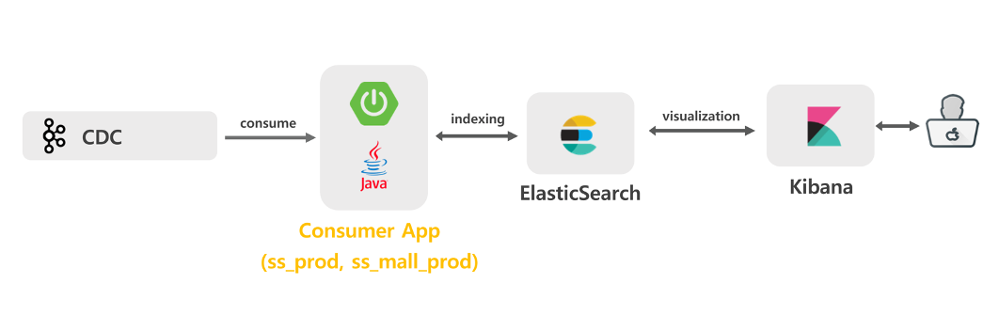
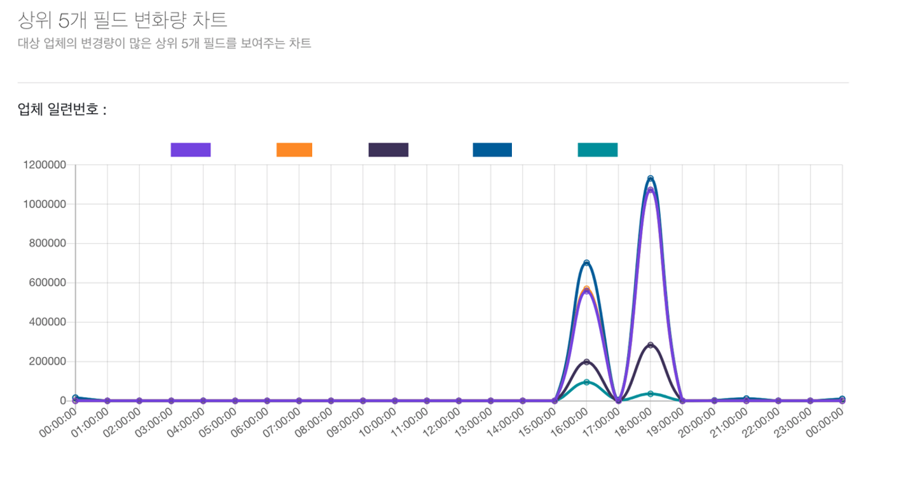
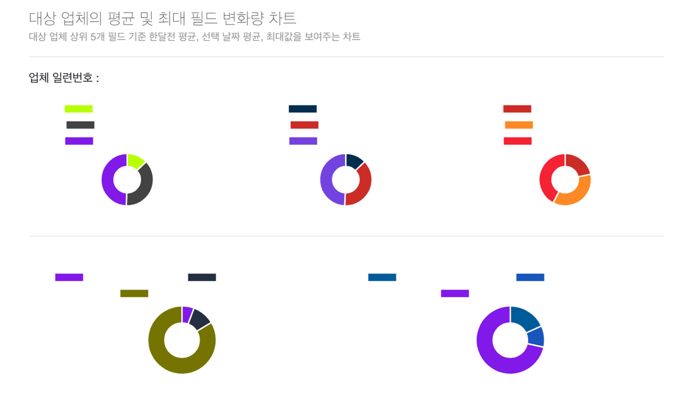
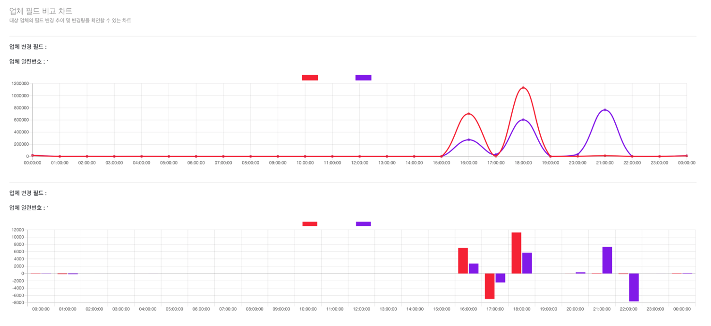
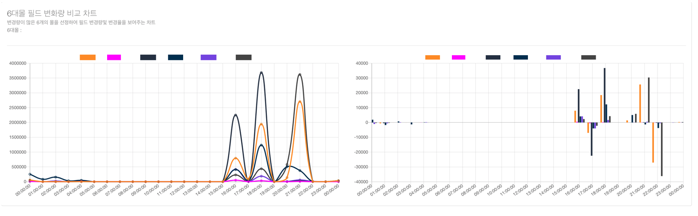

# 네이버 인턴

## 간단 소개

> **쇼핑 검색의 업체별 변경된 필드 데이터를 가지고 파이프라인 처리 및 시각화** ( 쇼핑 데이터에 대한 ETL 작업 및 BI Tool 제작 )

- 1차 과제 : 변경 필드 데이터를 분석하여 시각화 제공
- 2차 과제 : Kibana에 다루기 힘든 기능이나 x-pack 유료 기능들을 제공하기 위해 Custom BI Tool 제작

 

## 프로젝트 기간

- 1차 : 2020.12.07 ~ 2021.01.22
- 2차 : 2020.01.23 ~ 2020.02.26

 

## 개발 환경 / 기술

- 언어 : Java, JavaScript
- 프레임워크 : Spring boot, Spring batch, Apache Avro
- 미들웨어 : Elasticsearch, Kafka, Airflow, Kibana
- 데이터베이스 : PostgreSQL, MongoDB

 

## 상세 업무

> 1차 : PostgreSQL에서 변경된 데이터들이 CDC 카프카에 들어오면 해당 토픽을 consume 해서 데이터 가공 및 시각화 제공

- CDC에 Avro 타입으로 Message가 저장되는데 그중 op 타입이 update인 경우에만 추출하여 데이터 가공
- Consumer APP에 Elasticsearch 색인 모듈 구현
- Elasticsearch 인덱스 매핑 정보 및 샤드 개수, 레플리카 개수 등 설계
- Elasticsearch에 색인 된 도큐먼트들을 Kibana로 시각화

> 2차 : Elasticsearch의 데이터 생명 주기 문제점 해결 및 Kibana에서 제공하기 힘든 기능들을 제공하기 위해 Custom BI Tool 제작

- Elasticsearch의 특성상 Data Storage와 맞지 않는다고 판단 (historical한 데이터 유지 x)
- Kibana Rollup을 통해 필요한 집계 데이터 재색인 설정
- Elasticsearch의 집계 모듈 구현
- 2차 가공된 데이터를 MongoDB에 저장
- React를 이용해 BI Tool Web Application 구현

 

## 1차 과제

### 1. 구조

- CDC 카프카에는 PostgreSQL에 변경된 데이터들이 토픽에 퍼블리싱되어 있음
- 퍼블리싱되어 있는 데이터들을 컨슈머 앱을 통해 컨슘하여 데이터를 추출
- 추출된 데이터를 Elasticsearch에 색인
- 색인 된 도큐먼트들을 Kibana로 시각화

### 2. 내가 한 역할

- Consumer 앱에서 Extract 모듈로 추출된 데이터를 Elasticsearch에 색인하는 색인 모듈 구현

  - 모듈로 만든 이유?
    - 현재는 2개의 토픽만 consume 하지만 추후 또 다른 토픽을 consume 해야 한다면 중복 코드가 발생할 거라 예상
    - 따라서 모듈을 만들어 의존성 주입만 해주면 편할 거라 판단
  - 모듈을 어떻게?
    - 모듈은 범용성, 확장성, 간편성을 가지고 있어야 한다고 생각
    - 하지만 토픽별로 색인 되어야 하는 매핑 정보가 스키마 리스하여 일관적이지 않은 구조를 지님
    - 따라서 제네릭과 가변인수를 사용하여 범용적으로 사용할 수 있게 구현
    - 또한 추상화를 통해 꼭 필요한 정보와 추가 정보를 담을 수 있도록 구현

  * Elasticsearch 매핑 정보, 샤드 개수, 레플리카 개수 등 설계
    * 인덱스를 하루 단위로 생성
    * 샤드 개수는 Elasticsearch 공식 문서가 추천하는 샤드 사이즈 기준을 따름
    * 레플리카 개수는 fail-over 가능하도록 1개 설정 ( 1개 이상 만드는 것은 자원 낭비라 판단 )
    * Elasticsearch 매핑 정보를 설정한 이유?
      * Elasticsearch는 다른 NoSQL처럼 스키마 리스를 지원하기 때문에 매핑 정보를 설정 안 해도 되지만 설정을 안 하면 도큐먼트의 필드 타입이 text와 keyword 두 개가 생김
      * 이는 누적되면 Elasticsearch에 부담이 생길 것으로 판단해 매핑 정보 정의
  * Kibana로 시각화 작업 진행
    * Kibana의 Discover나 Dashboard를 통해 시각화 제공
    * 추가로 표현하고 싶은 시각화 정보는 Timelion 같은 기능으로 구현

### 3. 1차 과제의 아쉬웠던 점 및 2차 과제를 한 이유

- Elasticsearch의 기능인 ILM 주기가 3달이라 데이터 유지 불가능
- 즉 Historical 데이터 집계 불가
- 따라서 이러한 집계 데이터를 추출하고 가공하여 Kibana에서 보기 힘든 데이터를 시각화해 주면 좋을 것 같다고 판단
- 또한 Kibana의 유료 기능들을 직접 만들어 제공하면 좋을 것 같아 진행

 

## 2차 과제

### 1. 구조

- Elasticsearch에 색인 되어 있는 도큐먼트들을 Kibana Rollup Job을 사용해 원하는 집계 데이터 재색인
- 스프링 배치 잡을 사용하여 재색인 한 인덱스의 도큐먼트들을 가지고 와 데이터 가공
- 이때 아파치 Airflow로 cron 잡 진행 ( 1시간 단위로 진행 )
- 가공된 데이터를 몽고 DB에 저장
- Admin 애플리케이션을 만들어 몽고 DB에 저장된 데이터를 집계하여 React로 시각화 제공

### 2. 내가 한 역할

- Kibana Rollup Job 집계된 데이터 색인 및 cron 시간 설정
  - Kibana Rollup Job을 한 이유?
    - 필요한 집계 데이터를 빨리 가지고 오게 하기 위해 일종의 캐싱 역할을 한다고 생각
  - 스프링 배치 잡 어플리케이션을 만들어 Rollup Job으로 만들어진 인덱스를 집계 모듈로 집계 후 데이터 가공
    - Elasticsearch 인덱스 색인 모듈과 같이 집계 모듈을 구현
    - 집계 모듈 만들 때 다른 곳에서도 사용이 가능하도록 재귀로 구현
    - 집계 모듈로 데이터를 가지고 와 데이터 가공 후 몽고 DB에 저장
- Apache Airflow를 사용해 배치 잡 실행하는 DAG 작업 구현
  - Apache Airflow를 사용한 이유?
    - 제일 큰 이유는 팀에서 Airflow를 사용하는 추세여서 사용
    - DAG 기반이라 추후 다른 작업이 필요할 시 Airflow라면 쉽게 적용 가능하다고 판단
- Mongo DB에 저장된 데이터를 집계하여 React로 Custom BI Tool을 구현
  - React는 차트 라이브러리를 사용하여 시각화 기능 제공

### 3. 최종결과

- 상위 5개 필드 변경량 ( 최대 변경량 상위 5개 )

* 검색한 업체의 평균 및 최대 필드 변경량

* 업체별 비교 차트 ( 업체 2개 선택해서 비교 가능 )

- 중요한 6개 업체 필드 변경량 차트

### 4. 아쉬웠던 점 / 느낀 점

- 데이터 추출, 가공, 처리에 있어서 많은 것을 배울 수 있었음
- 시스템 관점에서 다양한 안목을 가질 수 있었던 계기
- 특히 일 1억 2천만 건의 데이터를 무리 없이 동작하게 구현함으로써 데이터 다루는 데 있어서 성장했다고 생각
- Elasticsearch에 의존을 많이 하다 보니 다른 플랫폼을 사용 못 해본 것이 아쉬움
- 실제 환경에서 배포를 못 한 것이 아쉬움 ( 정책상 이유로 배포를 하지 못함 )
