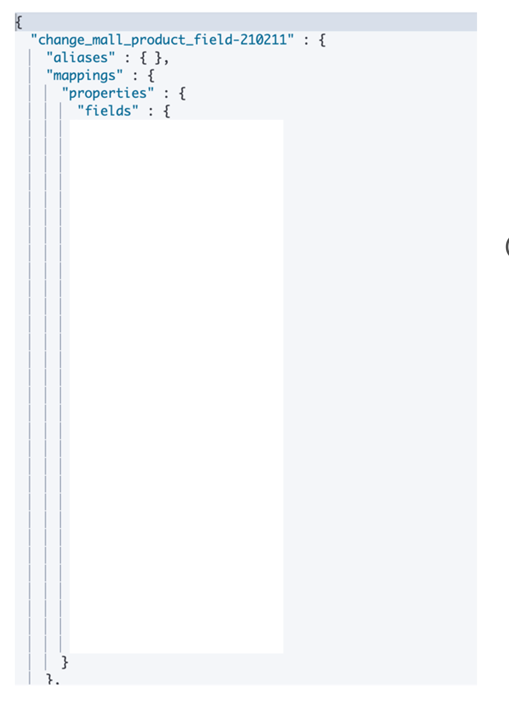
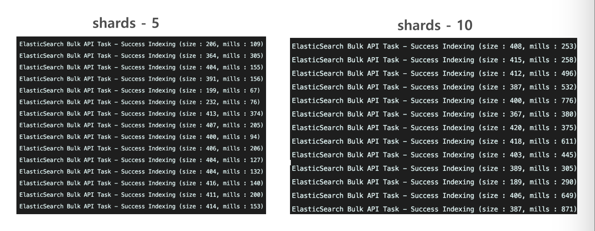
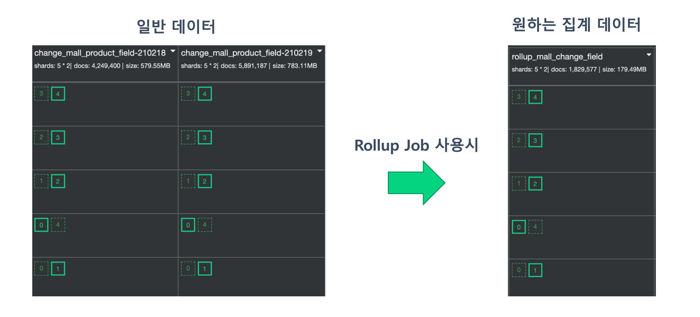
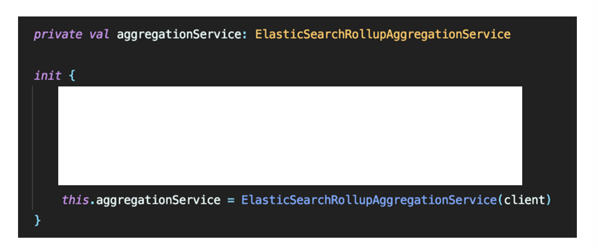
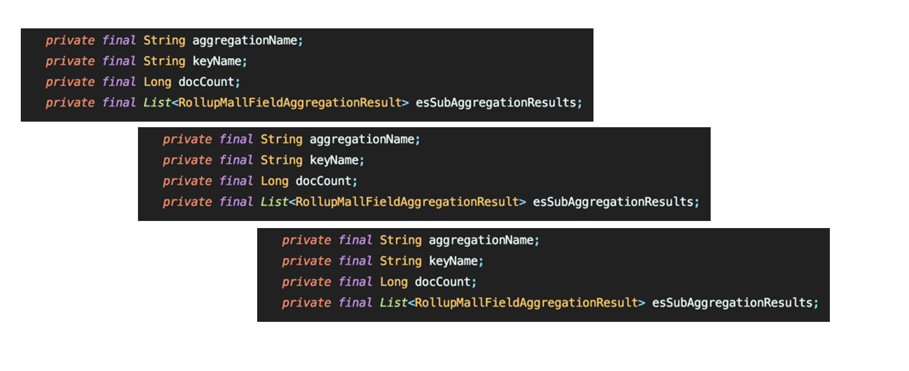
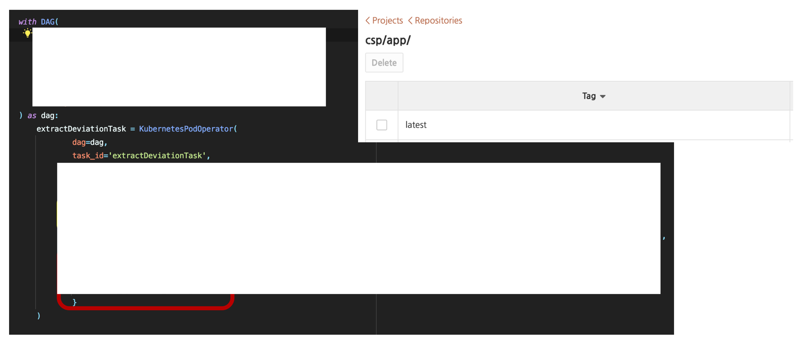
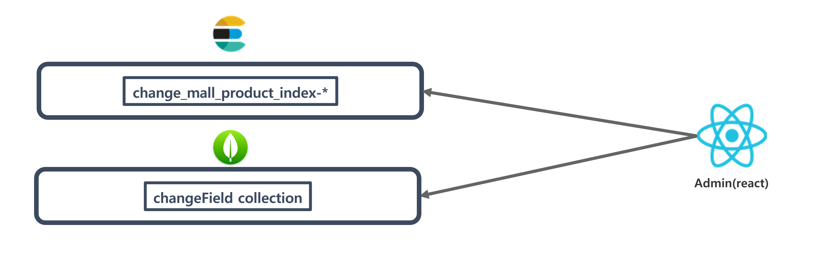

# 네이버 인턴

## 간단 소개

> **쇼핑 검색의 업체별 변경된 필드 데이터를 가지고 파이프라인 처리 및 시각화** ( 쇼핑 데이터에 대한 ETL 작업 및 BI Tool 제작 )

- 1차 과제 : 변경 필드 데이터를 분석하여 시각화 제공
- 2차 과제 : Kibana에 다루기 힘든 기능이나 x-pack 유료 기능들을 제공하기 위해 Custom BI Tool 제작

 

## 프로젝트 기간

- 1차 : 2020.12.07 ~ 2021.01.22
- 2차 : 2020.01.23 ~ 2020.02.26

 

## 개발 환경 / 기술

- 언어 : Java, JavaScript
- 프레임워크 : Spring boot, Spring batch, Apache Avro
- 미들웨어 : Elasticsearch, Kafka, Airflow, Kibana
- 데이터베이스 : PostgreSQL, MongoDB

 

## 상세 업무

> 1차 : PostgreSQL에서 변경된 데이터들이 CDC 카프카에 들어오면 해당 토픽을 consume 해서 데이터 가공 및 시각화 제공

- CDC에 Avro 타입으로 Message가 저장되는데 그중 op 타입이 update인 경우에만 추출하여 데이터 가공
- Consumer APP에 Elasticsearch 색인 모듈 구현
- Elasticsearch 인덱스 매핑 정보 및 샤드 개수, 레플리카 개수 등 설계
- Elasticsearch에 색인 된 도큐먼트들을 Kibana로 시각화

> 2차 : Elasticsearch의 데이터 생명 주기 문제점 해결 및 Kibana에서 제공하기 힘든 기능들을 제공하기 위해 Custom BI Tool 제작

- Elasticsearch의 특성상 Data Storage와 맞지 않는다고 판단 (historical한 데이터 유지 x)
- Kibana Rollup하여 필요한 집계 데이터 재색인 설정
- Elasticsearch의 집계 모듈 구현
- 2차 가공된 데이터를 MongoDB에 저장
- React를 이용해 BI Tool Web Application 구현

 

## 1차 과제 - 변경 필드량 시각화

### 0. 목표

> 변경 필드 데이터 시각화

### 1. 구조

* 상세 설명
  1. CDC 카프카에는 PostgreSQL에 변경된 데이터들이 토픽에 퍼블리싱되어 있음
  2. 퍼블리싱되어 있는 데이터들을 컨슘하여 데이터를 추출
  3. 추출된 데이터를 Elasticsearch에 색인
  4. 색인 된 도큐먼트들을 Kibana로 시각화

### 2. 내가 한 역할

1.  **Consumer 앱에서 Extract 모듈로 추출된 데이터를 Elasticsearch에 색인하는 색인 모듈 구현**

   1. 모듈로 만든 이유는?
      * 현재는 2개의 토픽만 consume 하지만 추후 또 다른 토픽을 consume 해야 한다면 ***중복 코드가*** 발생할 거라 예상
      * 따라서 모듈을 만들어 의존성 주입만 해주면 편할 거라 판단

   1. 모듈을 어떻게 만들어야 할까?
      * 모듈은 ***범용성, 확장성, 간편성을*** 가지고 있어야 한다고 생각
      * 하지만 토픽별로 색인 되어야 하는 매핑 정보가 스키마 리스하여 ***일관적이지 않은*** 구조를 지님
      * 따라서 제네릭과 가변인수를 사용하여 ***범용적으로 사용할 수 있게 구현***
      * 또한 ***추상화를*** 시켜 꼭 필요한 정보와 추가 정보를 담을 수 있도록 구현

2. **Elasticsearch 매핑 정보 설계**

   1. Elasticsearch 매핑 정보를 설정한 이유는?

      * Elasticsearch는 다른 NoSQL처럼 스키마 리스를 지원하기 때문에 매핑 정보를 설정 안 해도 되지만 설정을 안 하면 ***도큐먼트의 필드 타입이 text와 keyword 두 개가 생김***
      * 이는 누적되면 Elasticsearch에 부담이 생길 것으로 판단해 매핑 정보 정의

      * 인덱스 매핑 정보 설계 결과

        

3. **Elasticsearch 샤드 개수, 레플리카 개수 설계 및 성능 검증**

   1. 설계를 어떻게 했고 왜 그렇게 했는지?

      * 인덱스를 하루 단위로 생성
      * 샤드 개수는 Elasticsearch ***공식 문서가 추천하는 샤드 사이즈***와 ***성능 검증***을 토대로 설정
      * 레플리카 개수는 fail-over 가능하도록 1개 설정
        * 1개 이상 만드는 것은 자원 낭비라 판단

   2. 성능 검증은 어떻게 했는지?

      * 샤드 5개랑 샤드 10개일때, 직접 ***천만개*** 데이터를 Bulk 색인 시켜 테스트

      * 성능 검증 결과 - ***5개가 10개일때보다 성능이 향상된 것을 보여 샤드 5개로 설정***

        

4. **Kibana로 시각화 작업 진행**

   1. 어떻게 시각화 했는지?
      * Kibana의 Discover나 Dashboard를 사용하여 시각화 제공
   2. 부족한 시각화는 어떻게 해결했는지?
      * 추가로 표현하고 싶은 시각화 정보는 Timelion 같은 기능으로 구현

### 3. 최종 결과

* 업체별 필드 상위 10개 변경량

  
  
* 그 외 다수 대시보드 존재

### 4. 1차 과제의 문제점 및 아쉬웠던 점 / 2차 과제를 한 이유

* 1차 과제의 문제점 및 아쉬웠던 점

  1. 데이터 유지 문제

     

     * Elasticsearch의 기능인 ILM 주기가 3달이라 **데이터 유지 불가능** ( Historical한 데이터 집계 불가 )

  2. 떨어지는 접근성

     * 개발자에 특화되어 있는 키바나 도구로 인해 개발자가 아닌 관리자들이 접근하기 힘듬

  3. 키바나에서 제공하지 못하는 특별한 기능 제공
  
     
  
     * 집계 데이터를 추출하고 가공하여 Kibana에서 보기 힘든 데이터를 시각화해 주면 좋을 것 같다고 판단
     * Kibana의 유료 기능들을 직접 만들어 제공하면 좋을 것 같아 진행

> **따라서 위와 같은 문제점 및 아쉬웠던 점을 개선하고파 2차 과제 진행**

 

## 2차 과제 - 사용자 맞춤화 Custom BI Tool 제작

### 0. 목표

> 1차 과제의 문제점 해결 및 사용자가 원하는 데이터를 자유자제로 보여줄 수 있도록 구축

### 1. 구조

- 상세 설명

  1. Elasticsearch에 색인 되어 있는 도큐먼트들을 Kibana Rollup Job을 사용해 원하는 집계 데이터 재색인

  2. 스프링 배치 잡을 사용하여 재색인 한 인덱스의 도큐먼트들을 가지고 와 데이터 가공

  3. 이때 아파치 Airflow로 cron 잡 진행 ( 1시간 단위로 진행 )

  4. 가공된 데이터를 몽고 DB에 저장
  5. Admin 애플리케이션을 만들어 몽고 DB에 저장된 데이터를 집계하여 React로 시각화 제공

### 2. 내가 한 역할

1. **Kibana Rollup Job 집계된 데이터 색인 및 cron 시간 설정**

   1. Kibana Rollup Job을 한 이유?

     

     1. 필요한 집계 데이터를 빨리 가지고 오게 하기 위해 일종의 캐싱 역할을 한다고 생각
     2. 또한 기존 인덱스는 짧은 생명주기로 인해 historical한 데이터를 가지고 오게 해야한다면 문제가 발생할 수 있음
     3. 필요한 데이터만 롤업 시켜기 때문에 리소스 관리에 효과적이라 판단

   2. 인덱스 롤업한 결과

     

2. **스프링 배치 잡 어플리케이션을 만들어 Rollup Job으로 만들어진 인덱스를 집계 모듈로 집계 후 데이터 가공**

   1. 어떻게 구현할까?

      1. Elasticsearch 인덱스 집계 모듈을 코틀린으로 구현

         *  코틀린으로 구현한 이유?

           * 새로운 도전을 해보고 싶어서 진행
           * 자바 특유의 복잡성을 줄이고 싶어서 진행

         * 구현 코드

           

      2. 집계 모듈 만들 때 다른 곳에서도 사용이 가능하도록 ***(범용적으로 사용할 수 있도록)*** 재귀로 구현

         

      3. 집계 모듈로 데이터를 가지고 와 데이터 가공 후 몽고 DB에 색인 기능 구현

3. **Apache Airflow를 사용해 배치 잡 실행하는 DAG 작업 구현**

   1. Apache Airflow를 사용한 이유?

      * 제일 큰 이유는 팀에서 Airflow를 사용하는 추세여서 사용

      * DAG 기반이라 추후 다른 작업이 필요할 시 Airflow라면 쉽게 적용 가능하다고 판단

   2. Airflow DAG 구현 결과

      

4. **Mongo DB에 저장된 데이터를 집계하여 React로 Custom BI Tool을 구현**

   1. 구현 방법

      

      1. 엘라스틱 서치에서 2차 가공된 데이터 집계 
      2. 몽고 DB에서 2차 강고된 데이터 집계 -> 선택

   2. ElasticSearch 말고 Mongo DB를 선택한 이유는?

      * ElasticSearch는 특성상 로그성 데이터에 잘맞고 Mongo DB는 서비스에 잘 어울린다고 판단 -> ***사용자 맞춤화 서비스를 제작하는 것이기 때문에 Mongo DB 사용***

      * 컬렉션 구조만 같으면 재활용이 가능

   3. 성능 테스트 및 튜닝 작업 진행

      * Full Text Search로 인한 속도 저하 문제 발생할 것이라 판단

      * 천만개 데이터를 직접 넣어보고 테스트 진행

      * 결과 - ***평균 4 ~ 9 초 걸리는 집계 쿼리를 50 밀리세컨드로 속도 향상시키게 만듬 (160배 향상) ***

        

5. **React와 차트 라이브러리를 사용해 시각화 기능 제공**

   * React와 차트 라이브러리 사용한 이유?
     * 프론트 개발자가 아니기 때문에 래퍼런스가 많은 차트 라이브러리를 사용
     * React도 팀 내에서 많이 사용하기 때문에 기술 채택
   * 비동기로 API 통신

### 3. 최종결과

- 상위 5개 필드 변경량 ( 최대 변경량 상위 5개 )

  

- 검색한 업체의 평균 및 최대 필드 변경량

  

- 업체별 비교 차트 ( 업체 2개 선택해서 비교 가능 )

  

- 중요한 6개 업체 필드 변경량 차트

  

### 4. 2차 과제의 아쉬웠던 점 / 느낀 점

1. 2차 과제의 아쉬웠던 점
   * Elasticsearch에 의존을 많이 하다 보니 다른 플랫폼을 사용 못 해본 것이 아쉬움
   * 실제 환경에서 배포를 못 한 것이 아쉬움 ( 정책상 이유로 배포를 하지 못함 )
2. 2차 과제의 느낀 점
   * 데이터 엔지니어가 어떤일을 하는지 알 수 있었음
     * 데이터 추출, 가공, 처리에 있어서 많은 것을 학습을 할 수 있었던 계기
   * 시스템 과점에서 다양한 안목을 가질 수 있었음
     * 일 1억 2천만 건의 데이터를 무리 없이 동작하게 구현함으로써 데이터 다루는 데 있어서 성장했다고 생각
   * 협업을 통해 같이 성장하는 것을 느꼈고 멘토의 피드백을 통해 크게 성장했다고 느낌
