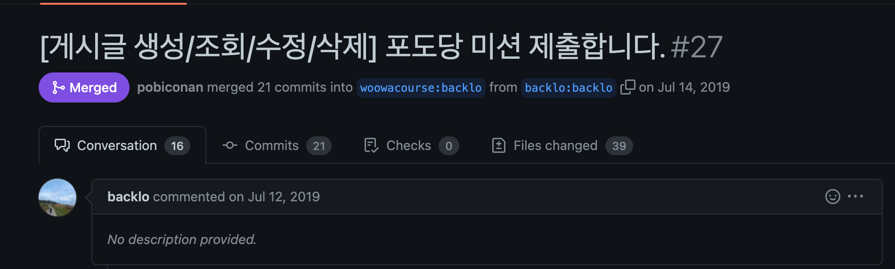
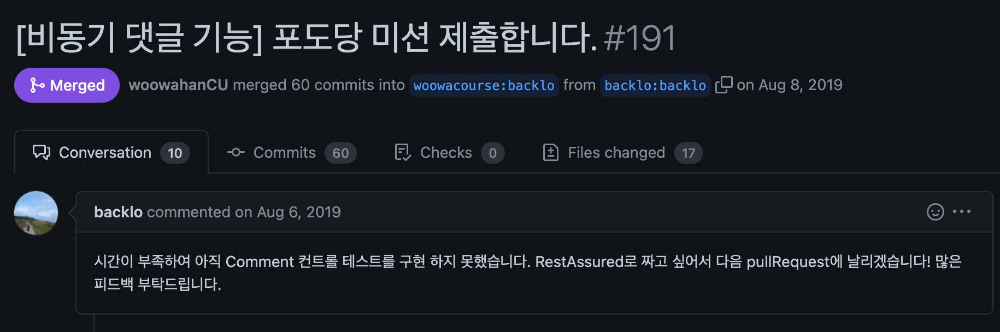

# 우아한테크코스

## 간단 소개

> **우아한 형제들에서 주관하는 자바 웹 백앤드 교육 코스** 
>
> 미션을 통해 백앤드 생태계를 배우고 자기주도 학습과 현장 중심의 경험, 깊이 있는 협업으로 성장

 

## 교육 기간

* 2019.05.07 ~ 2019.12.27

 

## 교육 커리큘럼

* [Level 1 - 프로그래밍 기본](#Level-1---프로그래밍-기본)
* [Level 2 - 웹 프로그래밍과 미니 팀 프로젝트](#Level-2---웹-프로그래밍과-미니-팀-프로젝트)
* [Level 3 - 웹 프로그래밍 심화](#Level-3---웹-프로그래밍-심화)
* [Level 4 - 팀 프로젝트](#Level-4---팀-프로젝트)

 

## Level 1 - 프로그래밍 기본

* 자바 프로그래밍 언어에 대한 기본 문법을 익혀 프로그램을 구현
* 읽기 좋은 코드를 구현하는 것이 왜 중요한지와 코드를 개선해 읽기 좋은 코드로 리팩토링 진행
* 단위테스트 / TDD 및 리팩토링을 통해 도메인 품질을 높임
* 페어 프로그래밍을 통해 협업을 경험

### 미션 1 - 자동차 경주 게임

* 미션 - [java-racingcar](https://github.com/backlo/java-racingcar-1/tree/backlo)
  * 자바로 자동차 경주 게임을 프로그래밍하는 미션
  * [PR Link](https://github.com/woowacourse/java-racingcar/pull/21)

### 미션 2 - 사다리 게임

* [java-ladder](https://github.com/backlo/java-ladder/tree/backlo)
  * 자바로 사다리 게임을 프로그래밍하는 미션
  * [PR Link](https://github.com/woowacourse/java-ladder/pull/17)
  

### 미션 3 - 좌표 계산기

* [java-coordinate](https://github.com/backlo/java-coordinate/tree/backlo)
  * 자바로 좌표 계산기를 프로그래밍하는 미션
  * [PR Link](https://github.com/woowacourse/java-coordinate/pull/50)

### 미션 4 - 로또 게임

* [java-lotto](https://github.com/backlo/java-lotto-1/tree/backlo)
  * 자바로 로또를 프로그래밍하는 미션
  * 2단계로 진행
    * [PR Link - Step1](https://github.com/woowacourse/java-lotto/pull/34) - 결과를 콘솔로 표현
    * [PR Link - Step2](https://github.com/woowacourse/java-lotto/pull/94) - 결과를 웹 UI로 표현
  

### 미션 5 - 체스 게임

* [java-chess](https://github.com/backlo/java-chess/tree/backlo)
  * 자바로 체스를 프로그래밍하는 미션
  * [PR Link](https://github.com/woowacourse/java-chess/pull/19)
  

 

## Level 2 - 웹 프로그래밍과 미니 팀 프로젝트

* Spring 프레임워크 기반으로 웹 애플리케이션을 개발
* TDD, ATDD 기반으로 웹 애플리케이션을 개발하고 리팩토링을 경험
* 프론트엔드, 백엔드, 데이터베이스 설계, 배포 등 서버에 대한 모든 프로세스를 거쳐 웹 애플리케이션 개발
* 팀 프로젝트를 통해 팀원들 간의 소통, 협업, 회고를 경험

### 미션 1 - 게시글 관련 기능 구현

* [jwp-blog](https://github.com/backlo/jwp-blog/tree/backlo)
  * 블로그의 게시글 CRUD 기능을 구현하는 미션
  * [PR Link](https://github.com/woowacourse/jwp-blog/pull/27)
  

### 미션 2 - Spring Data JPA / 회원 관련 기능 구현

* [jwp-blog](https://github.com/backlo/jwp-blog/tree/backlo)
  * 블로그의 회원 기능을 구현하는 미션
  * [PR Link](https://github.com/woowacourse/jwp-blog/pull/58)
  

### 미션 3 - 빌드&배포 구성 / 댓글 관련 기능 구현

* [jwp-blog](https://github.com/backlo/jwp-blog/tree/backlo)
  * 블로그의 동기 처리로 댓글 기능을 구현하는 미션
  * [PR Link](https://github.com/woowacourse/jwp-blog/pull/135)
  

### 미션 4 - 비동기 통신&API / 댓글 추가 기능 구현

* [jwp-blog](https://github.com/backlo/jwp-blog/tree/backlo)
  * 블로그의 비동기 처리로 댓글 기능을 구현하는 미션
  * [PR Link](https://github.com/woowacourse/jwp-blog/pull/191)

### 미니 프로젝트

* [MiniProject](https://github.com/woowahan-ioi)
  * 4주간 진행한 유튜브 클론 미니 프로젝트
  * 5명 팀을 이루어 협업
  * 내가 맡은 업무
    * JPA로 동영상 관련 CRUD 작업 진행
    * 정적 파일을 업로드 시킬 AWS S3 연동 및 Mocking 테스트
    * 썸네일 추출 작업 진행
    * **자세한 내용은 링크를 통해 확인해주시면 감사하겠습니다 :) - [업무 상세 보기](https://github.com/backlo/miniprojects-2019)**
  * 관련 링크
    * [동영상 링크](https://www.youtube.com/playlist?list=PLgXGHBqgT2TsWUA5puZimG3DDlJTd370Q)

 

## Level 3 - 웹 프로그래밍 심화
* 웹 백엔드 개발자가 알아야 할 최소한의 컴퓨터 사이언스 지식을 학습
* 웹 서버를 직접 구현해 HTTP 및 서블릿 컨테이너의 동작 원리 이해
* JDBC 라이브러리, MVC, DI 프레임워크 구현을 통해 Spring 프레임워크의 동작 원리 이해
* 객체지향 설계, 인증 및 보안, WebSocket 경험
* 패킷을 직접 구현해 OSI 7 Layer 및 네트워크 통신 방식의 이해도 향상
* 대용량 서비스를 위한 시스템 아키텍처 설계, 데이터 처리 경험
* 레거시 코드를 점진적으로 리팩토링하고 애플리케이션 설계 역량을 높여 안정적으로 서비스를 운영해 보는 경험을 진행

### 미션 1 - HTTP 이해 / 웹 서버 구현

* [jwp-was](https://github.com/backlo/jwp-was)
  * 스프링 도움 없이 http가 어떻게 들어와서 처리되고 나가는지 직접 구현하는 미션
  * http가 구성하는 요소들을 파악하고 서블릿 컨테이너의 동작 원리를 알 수 있었던 미션
  * 쿠키, 세션 등 커스텀하게 조작해본 미션
  * [PR Link - Step1](https://github.com/woowacourse/jwp-was/pull/27)
  * [PR Link - Step2](https://github.com/woowacourse/jwp-was/pull/81)
### 미션 2 - MVC / @MVC 프레임워크 구현

* [jwp-mvc](https://github.com/backlo/jwp-mvc)
  * MVC를 이용해 웹 서버를 구현하는 미션
  * MVC 패턴과 MVC 프레임워크 대한 원리를 잘 파악할 수 있었던 미션
  * 직접 MVC 프레임워크를 다뤄보며 스프링 프레임워크의 구조를 한눈에 파악할 수 있었던 미션
  * [PR Link - Step1](https://github.com/woowacourse/jwp-mvc/pull/29)
  * [PR Link - Step2](https://github.com/woowacourse/jwp-mvc/pull/53)
  

### 미션 3 - 나만의 라이브러리 구현

* [jwp-jdbc](https://github.com/backlo/jwp-jdbc/tree/backlo)
  * JDBC 템플릿을 직접 구현해보는 미션
  * JDBC의 원리를 알아볼 수 있었던 미션
  * [PR Link - Step1](https://github.com/woowacourse/jwp-jdbc/pull/17)
  * [PR Link - Step2](https://github.com/woowacourse/jwp-jdbc/pull/51)
  

### 미션 4 - DI / DI 프레임워크 구현

* [jwp-di](https://github.com/backlo/jwp-di/tree/step2)
  * 스프링의 3대 요소인 DI를 직접 다뤄보며 웹 서버를 구현하는 미션
  * 리플렉션을 이용한 스캐너를 통해 빈을 관리해 DI의 원리를 알 수 있었던 미션
  * [PR Link - Step1](https://github.com/woowacourse/jwp-di/pull/45)
  * [PR Link - Step2](https://github.com/woowacourse/jwp-di/pull/82)
  

 

## Level 4 - 팀 프로젝트

* 개발 프로세스 기반으로 프로젝트 진행, 협업하는 경험
* 배포를 자동화하고, 피드백을 받아 지속해서 개선
* 서비스를 기획, 구현, 배포해 실사용자가 사용하도록 개발

### 팀 프로젝트

* [Stardium 프로젝트](https://github.com/billionaire-boys/stardium)

  * 2달간 진행한 팀 프로젝트
  * 5명 팀을 이루어 협업
  * 1차와 2차를 나누어 프로젝트 진행
    * 1차 - 빠른 기능 제작과 서비스를 배포한다는 목적을 두고 팀 프로젝트 진행
    * 2차 - 1차에서 마음에 안들거나 부족한 부분을 개선하기 위해 개인 프로젝트로 추가 진행

  * 내가 맡은 업무
    * 1차 - 팀 프로젝트
      * Stardium 서비스의 프론트 작업 진행 (thyme leaf, bootstrap 등)
      * 유저 관련 도메인 기능 구현 (CRUD, 차단 등)
      * 써드파티 로그인 기능 구현
    * 2차 - 개인 프로젝트
      * 동기에서 비동기로 변경 -> Rest API로 변경
      * 쿼리 튜닝
      * 세션 인증 -> OAuth + Jwt 방식으로 변경
      * 멀티 모듈 도입
    * **자세한 내용은 링크를 통해 확인해주시면 감사하겠습니다 :) - [업무 상세 보기](https://github.com/backlo/stardium)**
    
  * 관련 링크
    * [동영상 링크](https://www.youtube.com/watch?v=wkLuv0CkU60)

 

## 링크

* 우아한테크코스 - [보러가기](https://woowacourse.github.io)
* 우아한테크코스 Git 저장소 - [보러가기](https://github.com/woowacourse)